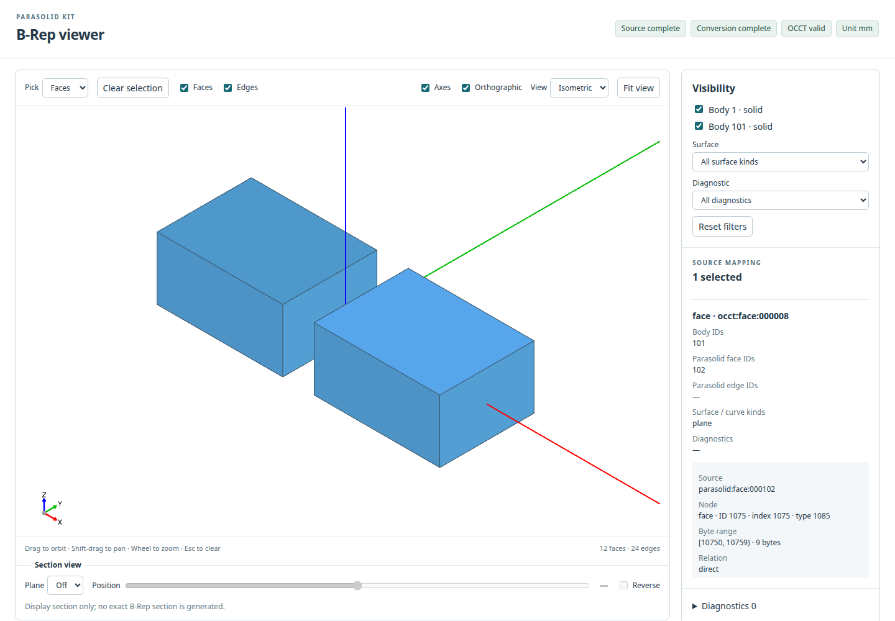

# parasolid-kit

The Python-independent Rust parser is also available as
[`parasolid-core`](https://crates.io/crates/parasolid-core). See its
[Rust API and input limitations](crates/parasolid-core/README.md).

`parasolid-kit` is a schema-aware parser for Parasolid X_T and
X_B transmit files. Parsing and geometry mapping run in a safe Rust core, while
Python users work with immutable typed models.

The project is read-focused. It is intended for file
inspection, validation, research, and conversion pipelines where preserving
the transmitted structure matters more than silently approximating unsupported
data.

## Features

- Inspect X_T and X_B headers without a schema catalog.
- Parse the verified Onshape V30/V13, extracted iCAD, and SolidWorks partition
  subsets without an external schema file.
- Use an explicit schema provider for inputs outside the built-in profiles.
- Reconstruct an unmodified parsed X_B document byte-for-byte.
- Compare X_T and X_B documents after pointer-index remapping.
- Map supported topology, analytic geometry, and NURBS records to a typed B-Rep
  source model.
- Parse, map, and summarize one file with `read_brep()` or the human-readable
  `check` command.
- Convert the exact optional OCCT subset and export validated AP242 plus a
  provenance sidecar without routing through CadQuery.
- Wrap the same strict conversion as CadQuery `Shape` values for immediate
  inspection and downstream CadQuery operations.
- Inspect bounded GLB/source previews with the bundled three-cad-viewer UI:
  face/edge source picking, body visibility, diagnostic filters, and section views.
- Return structured diagnostics and enforce configurable resource limits.
- Use the same functionality from Python or a command-line interface with
  deterministic JSON output where required.

See [format support and limitations](docs/format-support.md) before relying on
the parser for production data. Maintainers use the [release gates](docs/releasing.md).

## Installation

Python 3.10 or newer is required. Install the current release from
[PyPI](https://pypi.org/project/parasolid-kit/):

```bash
python -m pip install parasolid-kit
```

To install the stable release by exact version:

```bash
python -m pip install "parasolid-kit==0.1.0"
```

Alternatively, install a downloaded wheel directly:

```bash
python -m pip install /path/to/parasolid_kit-0.1.0-cp310-abi3-PLATFORM.whl
```

Header inspection works immediately after installation. Parsing and source
B-Rep checking also work without a schema file for the four exact-key
[supported profiles](docs/format-support.md#supported-profiles). Each covers a
verified subset with zero user fields; the table distinguishes producer,
encoding, geometry, and saved-state evidence. Native CAD containers are handled
by their own adapters. Other keys and uncovered types require an explicit
provider; see [Schema catalogs](#schema-catalogs). STEP, CadQuery, and preview
operations require an optional runtime and geometry supported by that adapter.

### Optional interoperability profiles

The base install remains parser-only and has no runtime dependency on a
geometry kernel. Two mutually exclusive profiles establish the optional OCCT
boundary:

```bash
# Headless OCP runtime without CadQuery or VTK; Python 3.10+
python -m pip install "parasolid-kit[occt]"

# CadQuery and its full OCP runtime; Linux/macOS, Python 3.11+
python -m pip install "parasolid-kit[cadquery]"
```

Do not install both profiles in one environment. Their OCP distributions can
provide the same Python import namespace; `parasolid-kit` detects that state
before importing OCP and reports commands for returning to one profile. There
is intentionally no `[all]` extra.

The base parser and `[occt]` profile support Linux, macOS, and Windows.
The `[cadquery]` profile supports Linux and macOS. On Windows, the tested
CadQuery runtime crashes during process shutdown, so CadQuery adapter calls
raise `interop.unsupported_platform` before importing the native runtime.
Use `[occt]` on Windows for conversion, STEP export, and preview.

On Intel macOS, the CadQuery extra uses Numba 0.62.x, the last release series
with prebuilt wheels for that platform. Use Python 3.11–3.13 for this profile
on Intel Macs; see [Numba's platform notice](https://numba.readthedocs.io/en/stable/release/0.63.0-notes.html#deprecation-of-macos-x86-64-intel-support).

The `[occt]` profile converts the documented exact I7 subset from `BrepModel` into a
validated OCCT shape and can export that result directly as AP242. The
`[cadquery]` profile runs the same strict converter with CadQuery's full OCP
runtime and exposes the result through CadQuery `Shape` objects. Tessellation
and the local viewer use the same OCCT result and are available in either
optional profile; they do not require VTK, a CDN, or Node.js at runtime.

You can confirm that one optional runtime is usable without importing it during
normal parsing:

```python
from parasolid_kit.interop import require_occt

OCP = require_occt()  # imports OCP only after distribution checks pass
```

Convert a parsed result by naming the source length unit explicitly:

```python
from parasolid_kit import read_brep
from parasolid_kit.interop.occt import to_occt, write_step

parsed = read_brep("box-v30.x_t")
converted = to_occt(
    parsed.brep,
    source_unit="m",
    target_unit="mm",
)

print(converted.report.occt_valid)
print(converted.report.metrics.to_dict())
print(converted.source_map.to_dict())
shape = converted.shape  # owned TopoDS_Shape runtime object

exported = write_step(
    converted,
    "model.step",
    output_unit="mm",
)
print(exported.report.validation.passed)
print(exported.sidecar_path)  # model.step.conversion.json
```

With the `[cadquery]` profile, the shortest interactive confirmation path is:

```python
from parasolid_kit.interop.cadquery import to_cadquery, to_cadquery_shapes

shape = to_cadquery(parsed.brep, source_unit="m")
print(type(shape).__name__, shape.BoundingBox(), shape.Area())
print(sum(solid.Volume() for solid in shape.Solids()))  # solid-only volume

# One immutable tuple entry per source body, in source order.
body_shapes = to_cadquery_shapes(parsed.brep, source_unit="m")
```

A single source body becomes its most specific CadQuery `Shape` subclass;
multiple bodies become a `cadquery.Compound`. The adapter does not infer a
`cadquery.Assembly`, reconstruct a `Workplane` chain, or recreate editable
feature history. Source mapping belongs to the original conversion result and must not
be treated as valid after a returned CadQuery object is modified.

I7 extends the exact OCCT path with ellipses, parabolas, hyperbolas, explicit
trimmed curves, cone frustums, untrimmed spheres and ring tori, open
non-periodic non-rational 3D NURBS, and exact offset surfaces.
`geometry_coverage()` exposes the parser, OCCT, STEP, and constraint status
without importing OCP. Rational, closed, or periodic NURBS, pcurves,
intersection curves, and blend surfaces remain explicit errors; they are not
approximated from incomplete semantics. Unknown orientation, invalid
references or topology, metric disagreement, and requested healing likewise
stop with `OcctConversionError`, whose partial report retains the diagnostic.
Generated OCCT seam/boundary topology remains explicit in the source map.

`write_step()` accepts only a complete, valid `OcctConversionResult`. It stages
both outputs, cold-reimports the STEP in a separate Python process, and commits
the final paths only after body/face counts, validity, bounding box, area, and
volume pass. Existing output is rejected unless `overwrite=True`. The sidecar
contains versions, units, conversion status, metrics, limits, and the complete
source mapping; a caller-provided path-like source identity is omitted by
default. A `source_identity="sha256:<digest>"` remains safe to retain.

To install from a source checkout, Rust 1.88 or newer is also required:

```bash
git clone https://github.com/monozukuri-ai/parasolid-kit.git
cd parasolid-kit
python -m pip install .
```

## Local viewer

To use the viewer described here, install this checkout with the OCCT extra in
a fresh virtual environment (Rust 1.88+ is required for a source install):

```bash
python -m pip install ".[occt]"
parasolid-kit viewer model.x_t --source-unit mm
```

Set `--source-unit` to the actual unit of your input; it is never inferred.
`view` is an alias. The command opens a loopback URL and keeps its five output
files after Ctrl-C. `--no-open` prints the URL without launching a browser;
`--write-only` generates files and exits. Node/npm are unnecessary for use.



Public synthetic two-body fixture, with source face 102 selected. Display colors
are illustrative. The image uses Linux/SwiftShader; it is not a real CAD-file test.

See the [preview API and controls](docs/api.md#bounded-local-preview) for saving,
reopening, units and partial output, [display limits](docs/format-support.md#viewer-display-boundary)
for supported scope, and [viewer development](viewer/README.md) for build/test steps.
The [validation record](docs/viewer-validation.md) separates local artifact checks
from unrun CI/platform tests; these changes have not been published as a release.

## Schema catalogs

When neither a provider nor a schema directory is supplied, default parsing
selects a compiled profile by the exact internal stream key. The
[shared support matrix](docs/format-support.md#supported-profiles) lists all
four keys, profile revisions, definition hashes, and stage-specific evidence.

The [SolidWorks partition profile](docs/solidworks-partitions.md) reads a
partition's B-Rep. Associated delta streams remain unsupported, so a complete
partition is not a reconstructed final SolidWorks configuration.

All have `verified_subset` coverage and require zero user fields. Runtime,
build, and installation need no external catalog or CAD installation; the
parser does not access the network. Normal package/build dependencies are
separate. Development catalog comparisons and the type-204 membership audit
are documented in the
[profile provenance](docs/builtin-profiles.md#sources-and-method).
[Profile provenance and coverage](docs/builtin-profiles.md) records their sources,
canonical hashes, and validation limits. The iCAD profile accepts extracted
Parasolid streams; `.icd` container parsing remains outside this package.

Use an external catalog for other keys or types outside these subsets.
An explicit provider is authoritative: an
empty provider or missing exact catalog fails without switching to the built-in
profile. `schema_provider=None` means default selection. Nearby versions and
the human-readable X_T common-header `SCH` value are never used as substitutes.

Siemens schema catalogs are not included in this repository or its packages.
Obtain the catalog from a Parasolid SDK or a Parasolid-based product available
to you, then point `--schema-dir` at the directory that contains it. The parser
reads the catalog in place and does not copy it into the package.

### 1. Find the required catalog

Inspecting the header does not require a catalog:

```bash
parasolid-kit inspect model.x_b
```

Read `header.schema_key` in the JSON output. When using an external provider,
the required filename is selected as follows:

| Internal schema key | Required catalog |
|---|---|
| `SCH_3000000_30000` | `sch_30000.sch_txt` |
| `SCH_3000310_30000_13006` | `sch_13006.sch_txt` |

For a two-number key, use the second number. For a three-number embedded-base
key, use the third number. This value is also called the *provider schema*.

### 2. Obtain and locate the catalog

- If you already have a Parasolid SDK or a Parasolid-based CAD product, search
  its installation directory for the exact filename. Product layouts vary;
  schema directories are commonly named `schema`, and an installation used
  during this project's validation placed them under `ETC/schema`.
- If you do not have a suitable installation, request access through the
  [Siemens Parasolid SDK](https://www.siemens.com/en-us/products/plm-components/parasolid/3d-modeling-sdk/),
  the [Siemens 3D SDK trial page](https://www.siemens.com/en-gb/products/plm-components/3d-sdk-software-trials/),
  or [Parasolid Support](https://parasolid-support.industrysoftware.automation.siemens.com/).
  Ask specifically for the numeric schema version reported by `inspect`.
- If the X_T/X_B file came from another CAD system, its vendor or the file
  producer may be able to supply the matching catalog or export to a Parasolid
  version for which you already have one.

For example, search a known product installation directory without scanning
the whole machine:

```bash
# Linux or macOS
find /path/to/product -type f -iname 'sch_13006.sch_txt'
```

```powershell
# Windows PowerShell
Get-ChildItem 'C:\path\to\product' -Recurse -File -Filter 'sch_13006.sch_txt'
```

Pass the containing directory, not the catalog file itself:

```bash
parasolid-kit check model.x_b --schema-dir /path/to/product/ETC/schema
```

`DirectorySchemaProvider` loads only the exact
`sch_<provider-schema>.sch_txt` filename and verifies that the identifier inside
the catalog matches. A similarly numbered catalog is not substituted.

## Python example

```python
from pathlib import Path

from parasolid_kit import read_brep

source = Path("model.x_b")
parsed = read_brep(
    source,
)

print(parsed.summary.to_dict())
print(len(parsed.document.nodes), len(parsed.brep.bodies), parsed.complete)
```

`read_brep()` selects X_T/X_B from a known suffix or signature, resolves the
exact built-in profile (or an explicitly supplied catalog), parses the document,
maps the B-Rep, and returns all three views as `ParsedBrep`.
`parsed.document.schema_resolution` and `parsed.summary.schema_resolution`
record the selected provider and built-in profile metadata.

The lower-level `inspect_xb()`, `parse_xb()`, `map_brep()`, and `write_xb()`
APIs remain available when each stage must be controlled independently.
`map_brep()` can return a valid but incomplete model when a well-formed geometry
record has no typed mapping yet. Inspect `parsed.complete` and
`parsed.brep.diagnostics` instead of assuming that every parsed record has been
interpreted. `complete` describes this stream's source B-Rep mapping, including
for a SolidWorks partition. It does not certify geometry evaluation, adapter
conversion, or a CAD container's saved configuration. See
[result stages](docs/format-support.md#result-stages-and-caller-responsibilities).

## Command line

These examples assume an input covered by the built-in profile. Add
`--schema-dir /path/to/schema` to select an external catalog explicitly.

```bash
# Header inspection does not need a schema catalog.
parasolid-kit inspect model.x_b

# Parse, map, and print a compact human-readable report.
parasolid-kit check model.x_b

# Use stable JSON when the result is consumed by another program.
parasolid-kit check model.x_t --json

# These examples use the exact built-in SCH_3000000_30000 subset.
parasolid-kit parse model.x_t
parasolid-kit parse model.x_b --brep
parasolid-kit compare model.x_t model.x_b

# Requires one optional profile; source units are explicit and output is
# cold-reimported before model.step becomes visible.
parasolid-kit export-step model.x_t model.step \
  --source-unit m

# Generate the same bounded artifacts, bind an ephemeral localhost port, and
# open the bundled offline viewer. Use --no-open for remote/CI shells.
parasolid-kit viewer model.x_t \
  --source-unit m
```

`check` is human-readable by default and accepts `--json`; the existing
`inspect`, `parse`, `compare`, `export-step`, and `viewer` reports remain JSON.
`viewer` (also available as `view`) uses the bundled three-cad-viewer UI and
writes `<input-stem>.parasolid-preview` before serving only its five
fixed resources from `127.0.0.1` and an ephemeral port. `--write-only` retains
the artifacts without a server, `--overwrite` replaces an existing output,
and non-loopback `--host` values require the separate `--allow-external`
acknowledgement. Partial display is opt-in with `--allow-partial` and always
shows a warning plus the missing-entity list. Exit
status is `0` when the requested stage succeeds (`inspect` validates a header
and raw `parse` validates a node stream), `1` for
an incomplete `check` result or a valid comparison that found differences, and
`2` for input, schema, parse, conversion, or export errors.
`parse --brep` can return `0` with `brep.complete=false`; use `check` when
completeness must affect the exit code. An allowed partial preview also returns
`0` if generation succeeds.
`python -m parasolid_kit` provides the same interface.

## Documentation

- [Python API](docs/api.md)
- [Format support and limitations](docs/format-support.md)
- [Built-in profile provenance](docs/builtin-profiles.md)
- [Corpus provenance and redistribution policy](corpus/README.md)
- [Viewer validation](docs/viewer-validation.md)

## Project boundaries

`parasolid-kit` does not parse native CAD containers such as iCAD `.icd`, CAD
assembly structures, occurrence transforms, visibility, or appearance. A
format-specific adapter can extract a bounded X_T/X_B payload and pass it to
this package without making the parser depend on that CAD product.
The iCAD container adapter has not been created; current evidence uses
locally extracted streams. sldkit already uses the shared Rust partial readers
for SolidWorks, with configuration and incomplete-state handling in its adapter.

The base package has no runtime dependency on a CAD product, geometry kernel,
or OpenCascade binding. Optional profiles add an explicitly selected OCP or
CadQuery runtime without making it part of the parser core. The package does
not bundle Siemens schema data or proprietary CAD files.

## License

The original implementation is under the [MIT License](LICENSE). Partial transmit
readers adopted from cadmpeg/sldkit are under [Apache-2.0](LICENSES/Apache-2.0.txt);
the combined distribution declares `MIT AND Apache-2.0`. See the
[reader provenance](crates/parasolid-core/PARTIAL_READERS.md).
The bundled viewer also contains third-party notices; see
[viewer dependencies and licenses](viewer/README.md#dependencies-and-licenses).
